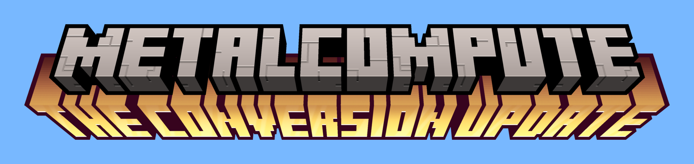

# MetalCompute
A C++ wrapper for the Apple metal-cpp library to make it easier to run compute kernels on the GPU

# Usage
It's a little more usable than last time. Include [MTLCompute.hpp](src/MTLCompute.hpp) for regular usage or [MTLComputeGPU.hpp](src/MTLComputeGPU.hpp) for easy usage. Everything is in the `MTLCompute::` namespace and have a look at the [examples](examples/) and the [docs](https://sphericalcylinder.github.io/MetalCompute/)
for more info. 

Building is simple, just run `cmake -S . -B build/` and then `cmake --build build/` in the top directory.

| Thing for CMake to do | Command |
| ----------------- | ------------------ |
| Build tests | `-DMTLCOMPUTE_BUILD_TESTS=ON` |
| Install tests | `-DMTLCOMPUTE_INSTALL_TESTS=ON` |
| Build docs | `-DMTLCOMPUTE_BUILD_DOCS=ON` |
| Install docs | `-DMTLCOMPUTE_INSTALL_DOCS=ON` |
| Build examples | `-DMTLCOMPUTE_BUILD_EXAMPLES=ON` |
| Install examples | `-DMTLCOMPUTE_INSTALL_EXAMPLES=ON` |

If you enable an install flag, the build flag will be automatically enabled as well.

# This release

Whoops! It's been two months! I got distracted by other things and then school started, which left
me with not a lot of spare time. This lovely update is absolutely useless in every sense of the word.
It adds functions and operator overloads that allow you to convert between Buffers, Texture1Ds, and
TextureBuffers. I'm pretty sure it's in the docs but I'll say it again. There is absolutely NO reason
(that I can think of) where a Texture1D or TextureBuffer would be a better option than a Buffer. I put
them in for continuity because they exist in the metal-cpp library. There's probably a better use for
them if you use that library instead of this because of reasons but whatever. Look at this cool 'Minecraft-esque'
photo with the release name. It probably won't become a regular thing, maybe just once in a while.
There's no timeline for the next update, maybe tomorrow, maybe in two months, who knows? This update
also includes refactoring all the files in src/ to LLVM 4-space standards. Yay! I am very tired.

- Still haven't written Buffer component tests
- AAAAAAAAAAAAA
- Why did I spend so much time on this update
  - It's useless
- These docs are going to suck
- If and when I write them

# Overview
Read the docs [here](https://sphericalcylinder.github.io/MetalCompute/). I spent a lot of time
on them so I hope they're good.

### Want to do:

- [ ] Command Manager different type support
- [x] Command Manager 1d and 3d texture support
- [x] Convert buffers to textures
- [x] More texture components (RGBA)

# About
I not so recently created a C++ application and wanted to use Apple's metal-cpp library to add gpu
proccessing capability, but I found out that it was hard to do. It eventually worked, but I don't want
to deal with that again, which is why I'm creating this.

## Goals
The goals for this project (which will probably change) are as follows:

- Concise and easy to read code
- A working API (duh)
- Minimal overhead
- Extensive documentation (Doxygen)
- Good, if not complete testing code coverage (doctest)
- and more!! (i cant think)

# Development Resources

- [Metal Docs](https://developer.apple.com/documentation/metal/) (they're in Objective-C)
- [Metal Best Practices](https://developer.apple.com/library/archive/documentation/3DDrawing/Conceptual/MTLBestPracticesGuide/index.html)
- [Metal Feature Set Tables](https://developer.apple.com/metal/Metal-Feature-Set-Tables.pdf)
- [Metal Shading Language Specs](https://developer.apple.com/metal/Metal-Shading-Language-Specification.pdf)

### The end :)
